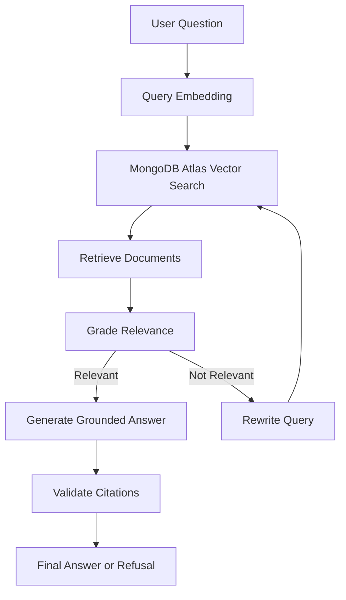

# RAG Agent Architecture

```mermaid
flowchart TD
    A[User Question] --> B[Query Embedding]
    B --> C[MongoDB Atlas Vector Search]
    C --> D[Retrieve Documents]
    D --> E[Grade Relevance]
    E -->|Relevant| F[Generate Grounded Answer]
    E -->|Not Relevant| G[Rewrite Query]
    G --> C
    F --> H[Validate Citations]
    H --> I[Final Answer or Refusal]
```